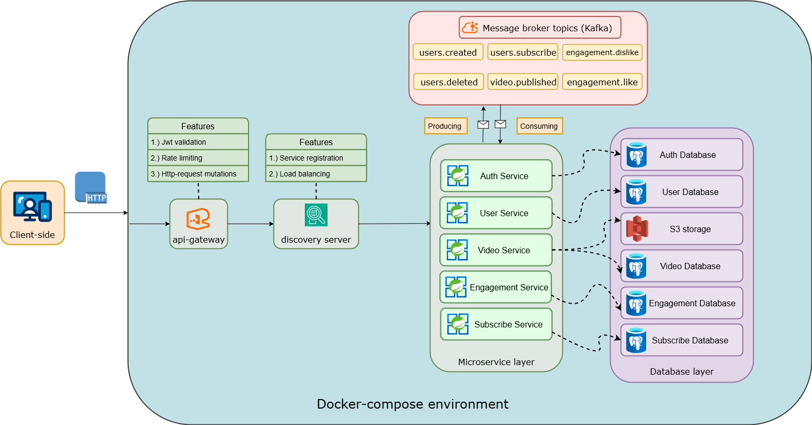

# 📺 Calmify
<b>Calmify</b> — это видео-платформа с открытым исходным кодом, построенная на микросервисной архитектуре с использованием Spring Framework.
Проект находится на ранней стадии разработки, но уже поддерживает базовую авторизацию и регистрацию сервисов.

### 🔹 Состояние проекта
Начальная стадия разработки

#### ✅ Реализовано:
- Регистрация сервисов в discovery-server
- Валидация токенов в api-gateway
- Регистрация, вход, обновление токенов в auth-service

#### 🔨 Разрабатывается:
- Маршрутизация запросов
- Сервис пользователей

## 💻 Технологии
#### На данный момент используются:
- Java 21
- Spring (Boot, Web, Security, Cloud, Data)
- Docker
- Kafka
- PostgreSQL
- Testcontainers
- Hibernate
- JUnit 5 & Mockito
- Github

## 📃 Архитектура проекта

